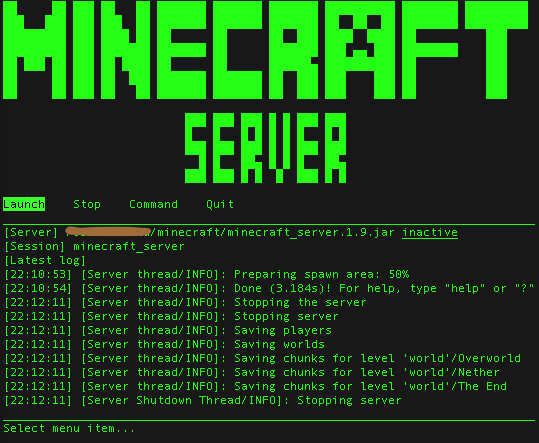

# Minecraft Server CUI Front-end (prov.)
This is front-end shell script for Minecraft server nogui mode. Name of this script is provisional.  

This image is on mac terminal.app with Homebrew profile (Andale Mono font).

## Installation  
1) This script execute `screen` such as `screen -S minecraft_server`. So you have to install `screen` at first. `apt-get install screen` etc.

2) Put this script anywhere you like and `chmod 755` this .sh file.

3) If you want to set default values (and execute without any options), You have to edit .sh file a little bit. Open .sh file in text editor and find "Default values" section. Adjust values to your environment.  

4) Done!

## Usage
Execute with following options if you need.  
[-p server_file_path] [-v] [-S session_name] [-j JAVA_command_path] [-x memory_size] [-s memory_size] [-h]

p: Path to server file.  
v: Verbose mode. Show latest server log under menu  
S: Server session name as `screen -S`  
j: JAVA command.  
x: XMX size for JAVA.  
s: XMS size for JAVA.  
h: Help

ex.)`mscf.sh -v -p ./minecraft_server.1.9.jar -S minecraft_server`

On the front-end, you can lunch/stop the server, send commands to the server. Choose your order from menu using left and right key and enter.
After quit the front-end, server continues to operate on screen with session name given as `-S` option or default value by the script. You can resume the front-end when you execute the script with the same options. Of course, You can attach the screen by `screen -r` with session name.

## To-do list

|priority|works|
|-----|----|
|C|external .ini file. (but it is not beautiful, isn't it?)|
|C|setting section. (for resuming the script without any options, .ini file is needed.)|
|C|no header logo mode. (I like this header...)|

## Change log
- ver. 0.1  
first published version

(c) kentay MIT license
